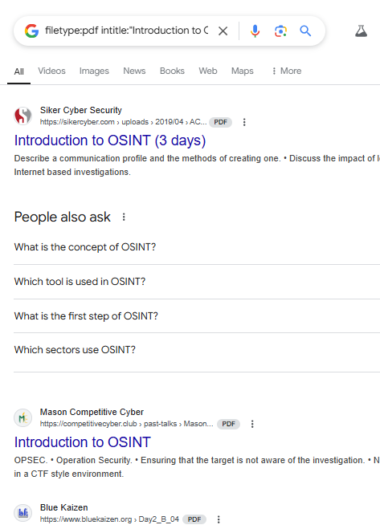
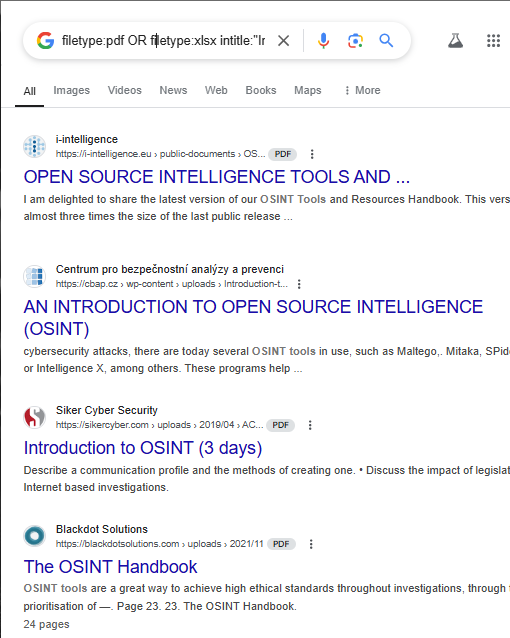

# Google Dorking

## 1. site:

The site operator is used to find specified instructions only in the targeted url.

*syntax: site:[ Target_URL ] [ Target String ]*

e.g *site: linkedin.com OSINT Jobs*

### Breakdown
**site: linkedin.com**, Restricts the search only to linkedin.com and the **cybersecurity jobs** specifies the keywords being searched in the target website.

## 2. filetype:

The filtype: operator is used in defining the file type of the expected results. File types will range from .docx, .xls, .epub, .webp etc

*syntax: filetype: [ type definantion ] [ method: ] [ Target String ]*

e.g *filetype:pdf intitle:"Introduction to OSINT"*

### Breakdown

**filetype:pdf** , restricts the search results only to pdf and the **intitle: "Introduction to OSINT"** specifies that only pdfs with that title should be provided in the results.

**You can go further to expand the search radius by the use of **OR** both by adding extra file types and target string.** 

***i.e filetype:pdf OR filetype:xlsx intitle:"Introduction to OSINT" OR "OSINT Tools"***

